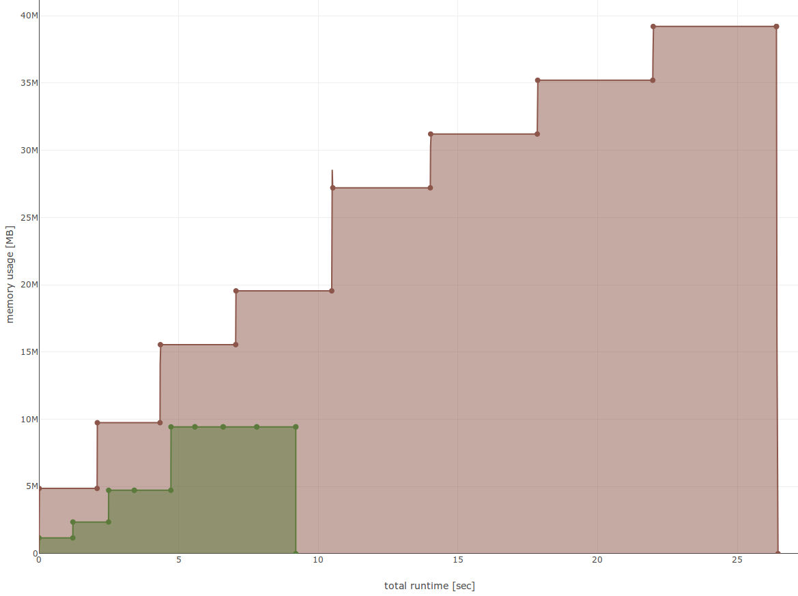

➵ robin_hood Benchmarks
=======================

I've performed extensive tests with [map_benchmark](https://github.com/martinus/map_benchmark), which can generate nice graphs of memory usage & runtime. In general, insertion & removal is by far the fastest of all maps I've tested. Find performance is 2-3 times faster than `std::unordered_map`, but slower than `absl::flat_hash_map`.

All benchmarks are done on an Intel i7-8700, Linux, compiled with `g++-8 -O3`.

## Insert
Measure runtime and memory usage when inserting 100M randomly generated `int`, then call `clear()`, then inserting again 100M `int`. [source](https://github.com/martinus/map_benchmark/blob/4f4ed87d1e73082bf1fde5e14e8c24b825c09db9/src/benchmarks/Insert.cpp#L5)

brown: `std::unordered_map<int, int>`, green: `robin_hood::unordered_map<int, int>`. std::unordered_map is 7 times slower and uses 2.7 times more memory. More results with other maps:

|                           | runtime [sec] | peak memory [MB] |
|--------------------------:|--------------:|-----------------:|
|     `absl::flat_hash_map` |          22.8 |         **1182** |
|     `absl::node_hash_map` |          82.1 |             5162 |
|    `robin_hood::flat_map` |      **10.4** |         **1182** |
|    `robin_hood::node_map` |          24.0 |             2416 |
|    `ska::bytell_hash_map` |          17.4 |             6252 |
|      `std::unordered_map` |          69.8 |             4982 |

## Random find
Insert 100k `uint32_t`, search 100M times. Repeat 8 times, so in total the map will contain 800k elements and 800M lookups are performed. [Source](https://github.com/martinus/map_benchmark/blob/4f4ed87d1e73082bf1fde5e14e8c24b825c09db9/src/benchmarks/RandomFindExisting.cpp#L11)

Brown is `std::unordered_map<uint32_t, uint32_t>`, green is `robin_hood::unordered_map<uint32_t, uint32_t>`.  `robin_hood::unordered_map` is 2.9 times faster while using 4 times less memory.

|                           | runtime [sec] | peak memory [MB] |
|--------------------------:|--------------:|-----------------:|
|     `absl::flat_hash_map` |       **6.7** |         **14.1** |
|     `absl::node_hash_map` |           9.6 |             41.4 |
|    `robin_hood::flat_map` |           9.2 |         **14.1** |
|    `robin_hood::node_map` |           9.8 |             18.9 |
|    `ska::bytell_hash_map` |           8.6 |             22.2 |
|      `std::unordered_map` |          26.5 |             14.1 |

## Insert & Lookup `std::string`

Uses 20 byte long `std::string` as key, and `size_t` as value. Inserts & lookups 50M strings so that about 25% are distinct. Brown is `std::unordered_map<std::string, size_t>`, green is `robin_hood::unordered_map<std::string, size_t>`. Here the difference is not so big, mostly because g++'s hash implementation uses a fast Murmurhash2 which is very similar to robin_hood's implementation. [Source](https://github.com/martinus/map_benchmark/blob/4f4ed87d1e73082bf1fde5e14e8c24b825c09db9/src/benchmarks/Strings.cpp#L44)

|                           | runtime [sec] | peak memory [MB] |
|--------------------------:|--------------:|-----------------:|
|     `absl::flat_hash_map` |          14.9 |             1325 |
|     `absl::node_hash_map` |          15.5 |             1329 |
|    `robin_hood::flat_map` |      **11.4** |             1300 |
|    `robin_hood::node_map` |          17.0 |         **1133** |
|    `ska::bytell_hash_map` |          14.6 |             2090 |
|      `std::unordered_map` |          16.2 |             1497 |

## Random Distinct

A mixed workload, similar to the benchmark used in [attractivechaos/udb2](https://github.com/attractivechaos/udb2). 50M `operator[]` are performed with random keys. This is done 4 times, with different number of prabability of accessing existing elements: 5% distinct values, 25% distinct, 50%, and purely random numbers with 100% distinctness. [Source](https://github.com/martinus/map_benchmark/blob/4f4ed87d1e73082bf1fde5e14e8c24b825c09db9/src/benchmarks/RandomDistinct.cpp#L5)

Brown is `std::unordered_map<int, int>`, green is `robin_hood::unordered_map<int, int>`. Again, peak memory for `robin_hood::unordered_map` is about 2.8 times lower while being more than 6 times faster.

|                           | runtime [sec] | peak memory [MB] |
|--------------------------:|--------------:|-----------------:|
|     `absl::flat_hash_map` |          18.7 |          **906** |
|     `absl::node_hash_map` |          53.9 |             2592 |
|    `robin_hood::flat_map` |       **7.7** |          **906** |
|    `robin_hood::node_map` |          25.8 |             1208 |
|    `ska::bytell_hash_map` |          10.9 |             1422 |
|      `std::unordered_map` |          49.2 |             2495 |

## Iteration

Repeat 50k times: insert one element, then iterate the whole map. After that, again repeat 50k times: delete on element, iterate the whole map. Thus in total 2500M elements are accessed. [Source](https://github.com/martinus/map_benchmark/blob/898a5c6d647df57692a9277d3cd1ed19a865dac4/src/benchmarks/Iterate.cpp#L5)

Brown is `std::unordered_map<uint64_t, size_t>`, green is `robin_hood::unordered_map<uint64_t, size_t>`. 

|                           | runtime [sec] | peak memory [MB] |
|--------------------------:|--------------:|-----------------:|
|     `absl::flat_hash_map` |          8.49 |         **0.88** |
|     `absl::node_hash_map` |          8.86 |             2.58 |
|    `robin_hood::flat_map` |      **6.98** |         **0.88** |
|    `robin_hood::node_map` |          7.80 |             1.18 |
|    `ska::bytell_hash_map` |         17.01 |             1.39 |
|      `std::unordered_map` |         16.43 |             2.42 |
