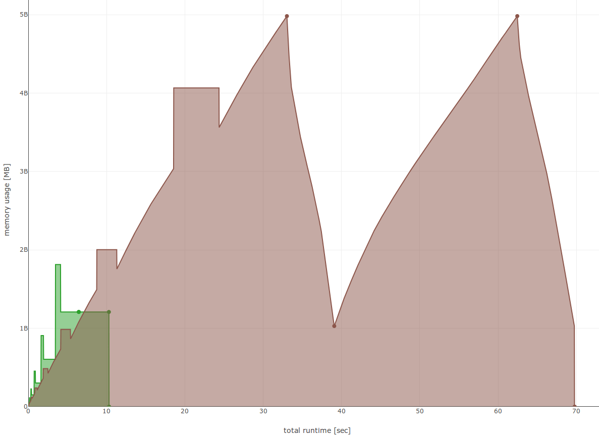
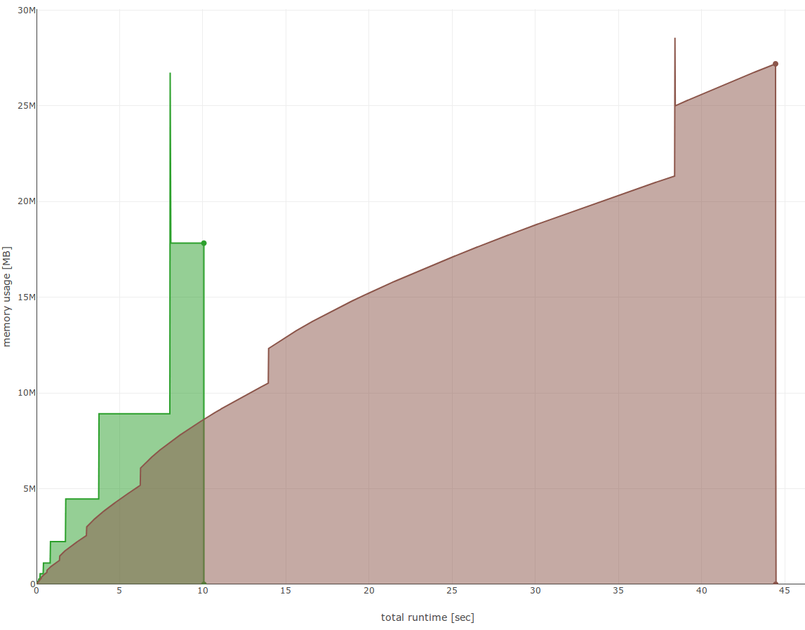
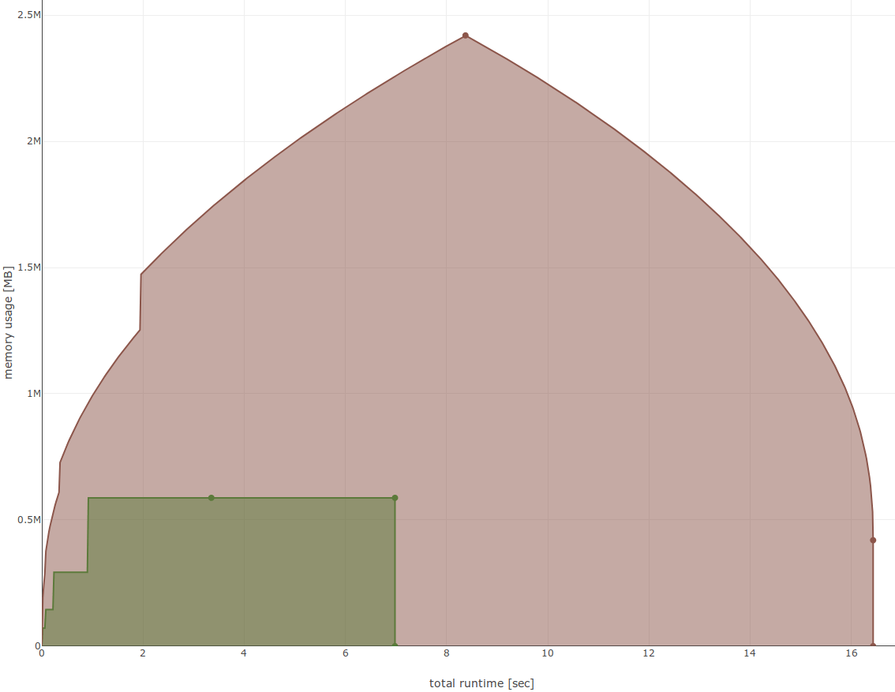
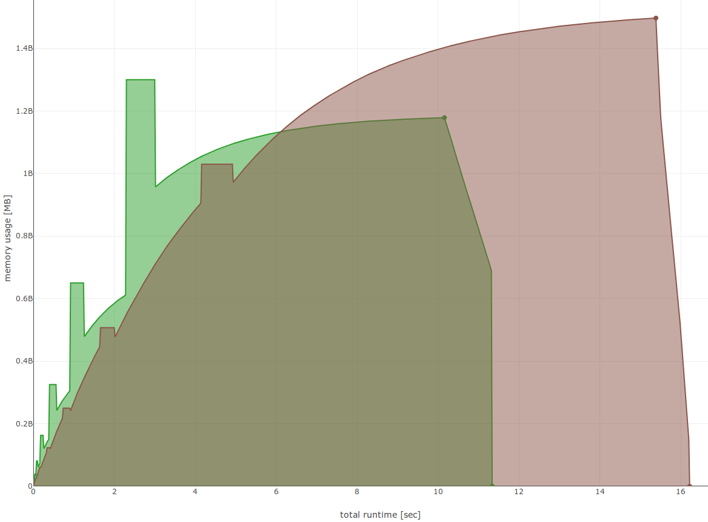
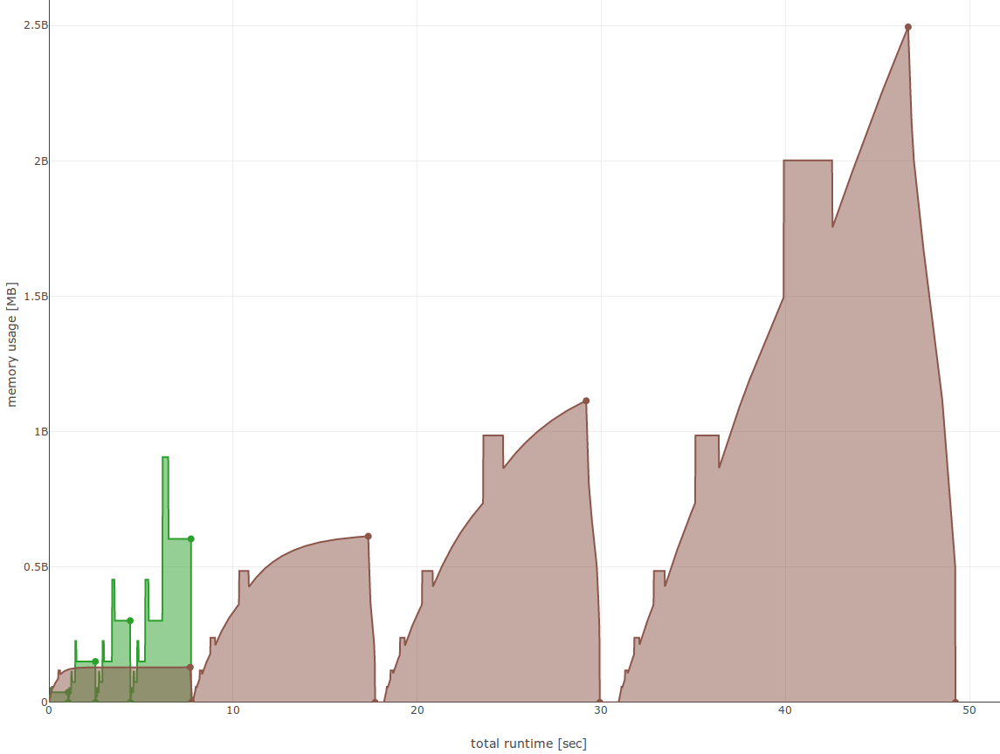

➵ robin_hood Benchmarks
=======================

I've performed extensive tests with [map_benchmark](https://github.com/martinus/map_benchmark), which can generate nice graphs of memory usage & runtime. 

All benchmarks are done on an Intel i7-8700, Linux, compiled with `g++-8 -O3`. For accurate memory graphs, I'm hooking `malloc`, `free`, `calloc`, `realloc` and track current and peak memory usage. This introduces a bit of an overhead, but in my benchmarks this had no measurable effect on runtime. See [MallocHook.cpp](https://github.com/martinus/map_benchmark/blob/master/src/app/MallocHook.cpp). The resulting graphs often give good insight in how the data structures work internally.

The graphs are generated by periodically (50 times per second) capturing memory stats. See [PeriodicMemoryStats.h](https://github.com/martinus/map_benchmark/blob/master/src/app/PeriodicMemoryStats.h). Random numbers are generated with [Sfc64](https://github.com/martinus/map_benchmark/blob/master/src/app/sfc64.h) which is extremely fast and produces high quality random numbers.

## TL;DR

1. In all benchmarks `robin_hood::unordered_flat_map` is fastest.
1. In all benchmarks either `robin_hood::unordered_flat_map` or `robin_hood::unordered_node_map` uses the least amount of peak memory.

## Insert
Measure runtime and memory usage when inserting 100M randomly generated `int`, then call `clear()`, then inserting
again 100M `int`.
[Source](https://github.com/martinus/map_benchmark/blob/4f4ed87d1e73082bf1fde5e14e8c24b825c09db9/src/benchmarks/Insert.cpp#L5).

brown: `std::unordered_map<int, int>`, green: `robin_hood::unordered_map<int, int>` (defaulting to `unordered_flat_map`). More results with other maps. Speedup and peak memory is relative to `std::unordered_map`.

|   flat maps                     | runtime [sec] | peak memory [MB] |  speedup   | peak memory [%] |
|:--------------------------------|--------------:|-----------------:|-----------:|----------------:|
|           `absl::flat_hash_map` |          22.8 |         **1182** |   3.06     |    **24%**      |
|`robin_hood::unordered_flat_map` |      **10.4** |         **1182** |  **6.71**  |    **24%**      |
|          `ska::bytell_hash_map` |          17.4 |             6252 |   4.01     |   125%          |

|   pointer stable maps           | runtime [sec] | peak memory [MB] |  speedup   | peak memory [%] |
|:--------------------------------|--------------:|-----------------:|-----------:|----------------:|
|           `absl::node_hash_map` |          82.1 |             5162 |   0.85     |   104%          |
|`robin_hood::unordered_node_map` |          24.0 |             2416 |   2.91     |   48%           |
|            `std::unordered_map` |          69.8 |             4982 |   1.00     |   100%          |

## Find
Benchmarks finding elements with an enlarging map, and with a find probability of 50%. This makes sure that we get a
wide range different load factors to get a relatively unbiased result.

In detail, we iterate `i` from 1 to 1M, and with 50% probability insert `i` into the map. Thus, about 50% of the
values are inserted, the map will contain about 500k elements. Each iteration perform 1000 finds of random values
in the range [0, i(. So we perform a total of 1000M searches of which about 50% will find an element.
[Source](https://github.com/martinus/map_benchmark/blob/a62f9a4c1be91b726c73e26653610dec5bb74849/src/benchmarks/RandomFind.cpp#L6).

 Brown is `std::unordered_map<size_t, size_t>`, green is `robin_hood::unordered_map<size_t, size_t>` (defaulting to `unordered_flat_map`).

|      flat maps                  | runtime [sec] | peak memory [MB] |  speedup    | peak memory [%] |
|:--------------------------------|--------------:|-----------------:|------------:|----------------:|
|     `absl::flat_hash_map`       |          13.3 |             26.7 |  3.35       |    93%          |
|`robin_hood::unordered_flat_map` |      **10.1** |             26.7 |  **4.41**   |    93%          |
|    `ska::bytell_hash_map`       |          14.0 |         **21.0** |  3.18       |    **73%**      |

|  pointer stable maps            | runtime [sec] | peak memory [MB] |  speedup    | peak memory [%] |
|:--------------------------------|--------------:|-----------------:|------------:|----------------:|
|           `absl::node_hash_map` |          18.6 |             32.5 |  2.39       |   114%          |
|`robin_hood::unordered_node_map` |          12.2 |         **21.0** |  3.65       |   **73%**       |
|      `std::unordered_map`       |          44.5 |             28.6 |  1.00       |   100%          |

## Iteration

Repeat 50k times: insert one element, then iterate the whole map. After that, again repeat 50k times: delete one element, iterate the whole map. Thus in total 2500M elements are iterated. [Source](https://github.com/martinus/map_benchmark/blob/898a5c6d647df57692a9277d3cd1ed19a865dac4/src/benchmarks/Iterate.cpp#L5)

Brown is `std::unordered_map<uint64_t, size_t>`, green is `robin_hood::unordered_map<uint64_t, size_t>` (defaulting to `unordered_flat_map`). 

|    flat maps                    | runtime [sec] | peak memory [MB] |  speedup    | peak memory [%] |
|:--------------------------------|--------------:|-----------------:|------------:|----------------:|
|     `absl::flat_hash_map`       |          8.49 |         **0.88** |  1.94       |   **36%**       |
|`robin_hood::unordered_flat_map` |      **6.98** |         **0.88** |  **2.35**   |   **36%**       |
|          `ska::bytell_hash_map` |         17.01 |             1.39 |  0.97       |    57%          |

|   pointer stable maps           | runtime [sec] | peak memory [MB] |  speedup    | peak memory [%] |
|:--------------------------------|--------------:|-----------------:|------------:|----------------:|
|     `absl::node_hash_map`       |          8.86 |             2.58 |  1.85       |   107%          |
|`robin_hood::unordered_node_map` |          7.80 |             1.18 |  2.11       |    49%          |
|            `std::unordered_map` |         16.43 |             2.42 |  1.00       |   100%          |

## Insert & Lookup `std::string`

Uses 20 byte long `std::string` as key, and `size_t` as value. Inserts & lookups 50M strings so that about 25% are distinct. Brown is `std::unordered_map<std::string, size_t>`, green is `robin_hood::unordered_map<std::string, size_t>`. Here the difference is not so big, mostly because g++'s hash implementation uses a fast Murmurhash2 which is very similar to robin_hood's implementation. [Source](https://github.com/martinus/map_benchmark/blob/4f4ed87d1e73082bf1fde5e14e8c24b825c09db9/src/benchmarks/Strings.cpp#L44)

Brown is `std::unordered_map<std::string, size_t>`, green is `robin_hood::unordered_map<std::string, size_t>` (defaulting to `unordered_flat_map`).

|flat maps                        | runtime [sec] | peak memory [MB] |  speedup    | peak memory [%] |
|:--------------------------------|--------------:|-----------------:|------------:|----------------:|
|           `absl::flat_hash_map` |          14.9 |             1325 |  1.09       |   89%           |
|`robin_hood::unordered_flat_map` |      **11.4** |             1300 |  **1.42**   |   87%           |
|          `ska::bytell_hash_map` |          14.6 |             2090 |  1.11       |   140%          |

|pointer stable maps              | runtime [sec] | peak memory [MB] |  speedup    | peak memory [%] |
|:--------------------------------|--------------:|-----------------:|------------:|----------------:|
|           `absl::node_hash_map` |          15.5 |             1329 |  1.05       |   89%           |
|`robin_hood::unordered_node_map` |          17.0 |         **1133** |  0.95       |   **76%**       |
|            `std::unordered_map` |          16.2 |             1497 |  1.00       |   100%          |

## Random Distinct

A mixed workload, similar to the benchmark used in [attractivechaos/udb2](https://github.com/attractivechaos/udb2). 50M `operator[]` are performed with random keys. This is done 4 times with a new map, with different number of prabability of accessing existing elements: 5% distinct values, 25% distinct, 50%, and purely random numbers with 100% distinctness. [Source](https://github.com/martinus/map_benchmark/blob/4f4ed87d1e73082bf1fde5e14e8c24b825c09db9/src/benchmarks/RandomDistinct.cpp#L5)

Brown is `std::unordered_map<int, int>`, green is `robin_hood::unordered_map<int, int>` (defaulting to `unordered_flat_map`).

|  flat maps                      | runtime [sec] | peak memory [MB] |  speedup    | peak memory [%] |
|:--------------------------------|--------------:|-----------------:|------------:|----------------:|
|           `absl::flat_hash_map` |          18.7 |          **906** |  2.63       |   **36%**       |
|`robin_hood::unordered_flat_map` |       **7.7** |          **906** |  **6.39**   |   **36%**       |
|          `ska::bytell_hash_map` |          10.9 |             1422 |  4.51       |    57%          |

| pointer stable maps             | runtime [sec] | peak memory [MB] |  speedup    | peak memory [%] |
|:--------------------------------|--------------:|-----------------:|------------:|----------------:|
|           `absl::node_hash_map` |          53.9 |             2592 |  0.91       |   104%          |
|`robin_hood::unordered_node_map` |          25.8 |             1208 |  1.91       |    48%          |
|            `std::unordered_map` |          49.2 |             2495 |  1.00       |   100%          |
